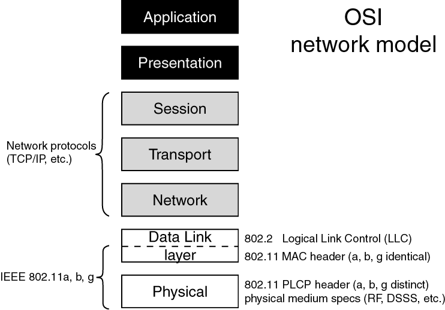

# IEEE 802

IEEE (The Institute of Electrical and Electronics Engineers), 1884 yılında Alexander Graham Bell ve Thomas Edison gibi dönemin büyük bilim adamlarınca temelleri atılmış, elektrik, elektronik, bilgisayar, otomasyon, telekomünikasyon ve diğer bir çok alanda, mühendislik teori ve uygulamalarının gelişimi için çalışan, kar amacı gütmeyen, dünyanın önde gelen teknik organizasyonudur.

802, IEEE'nin yerel ve geniş alan ağları için belirlediği standartları içeren protokoller ailesidir.İsminin, ortaya atılış tarihi olan 1980 yılının 2. ayından geldiği düşünülmektedir. [Şuradan](http://serverfault.com/questions/231375/what-is-the-significance-of-the-number-802-in-ieee-networking-specifications) okuyabilirsiniz.

802 kurallar ailesinde bir çok kural/protokol vardır.En çok bilinenleri:

1. IEEE 802.1  => High Layer LAN
2. IEEE 802.3  => Ethernet
3. IEEE 802.5  => Token Ring
4. IEEE 802.11 => Wireless LAN

Diğerleri için [bkz](https://en.wikipedia.org/wiki/IEEE_802#Working_groups)

# IEEE 802.11

IEEE 802.11, kablosuz yerel ağ uygulaması için 900 MHz ve 2.4, 3.6, 5 ve 60 GHz frekans bandlarında çalışan ve OSI Modelinde 2. katman olan [Veri Bağlantı Katmanı](https://en.wikipedia.org/wiki/Data_link_layer)nın 2 alt katmanından biri olan MAC(Media Access Control) altkatmanı ile OSI Modelinde 1. katman olan [Fiziksel Katman](https://en.wikipedia.org/wiki/Physical_layer)ın özelliklerinin bir kümesidir.

Tanım çok karmaşık oldu sanırım, aslında gayet sade yapmaya çalıştım ama sanırım anlamak için 2-3 kere okumanız gerekebilir.Eğer anlamadıysanız korkmayın, çünkü bu döküman kablosuz ağları en iyi şekilde anlamanız için oluşturuldu.

Aşağıdaki resimde 802.11'in -dökümanın devamında wlan ya da kablosuz denilecektir- OSI modelindeki yeri gösteriliyor.Dikkatli inceleyin!

Gördüğünüz gibi, üstte tanımda da bahsedildiği gibi, kablosuz protokolü, OSI Modelinin en altında bulunan Fiziksel katman ve bi üst katman olan Veri Bağlantı(Data Link) katmanının MAC adlı alt katmanını kapsıyor.

Yalnız burda gözünüze çarpan muhtemel bir ayrıntı, 802.11a,b,g nin ne olduğudur.Bu 802.11 protokollerinin sürümleri olarak adlandırılabilir.Aşağıda önemli olanlar liste hâlinde verilmiştir.

|Protokol|Tarih|Frekans(GHz)|Band Genişliği|Veri akış hızı (Mbit/s)|Azami Hız(Mbit/s)|Kapalı Alan Menzil(m)|Açık Alan Menzil(m)|
|:---:|:---:|:---:|:---:|:---:|:---:|:---:|:---:|
|802.11|1997|2.4|22|0.7|2|20|75|
|802.11a|1999|5 , 3.7|20|23|54|13|100|
|802.11b|1999|2.4 , 2.5|22|4|11|35|110|
|802.11g|2003|2.4|20|19|54|35|110|
|802.11n|2008|2.4 , 5|40|74|450|70|250|
|802.11ac|2013|5|80|433|1300|35|-|
|802.11ac|2013|5|160|1690|6700|35|-|

*Rakamlar [Wikipeadia](https://en.wikipedia.org/wiki/IEEE_802.11#Protocol)'dan alınmıştır.*

İlk bir kaç makale sıkabilir sizi, çünkü işin teorik kısmını anlatmaya çalışacağım.Fakat sonrasında daha zevkli hâle gelecektir örneklerle :) Sabredin.

Hadi başlayalım.

İçerik:
* Mimari
* Medium Access Control
- item
- item
- qweqw
